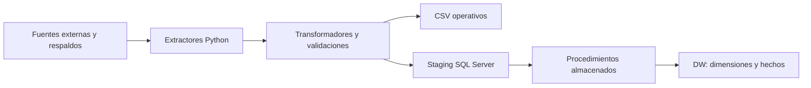
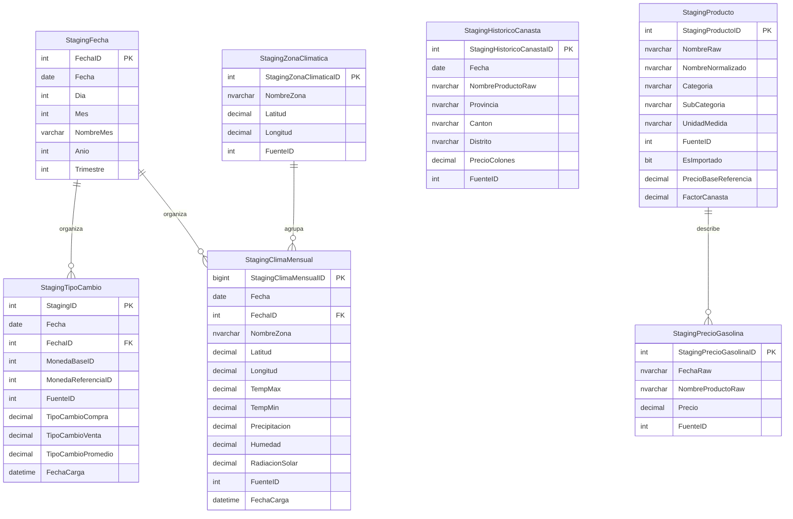
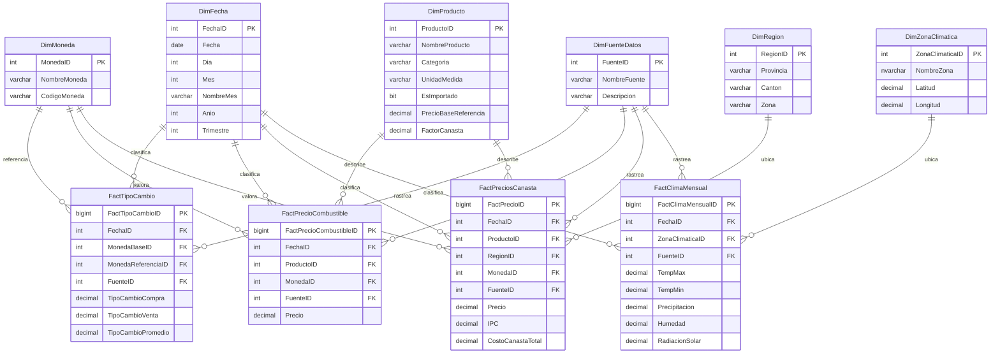
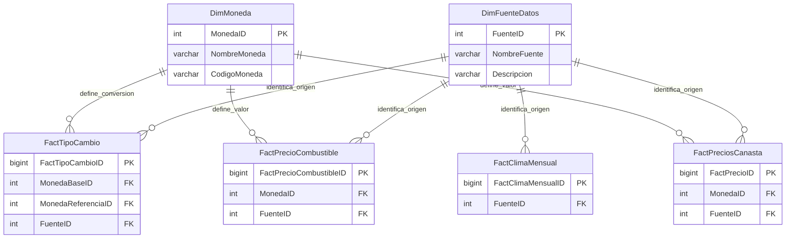

# ETL de Tipo de Cambio, Combustibles, Canasta y Clima

Este repositorio implementa un flujo ETL en Python + SQL Server para poblar un `staging` operacional y luego cargar un Data Warehouse. El proyecto no depende de una sola fuente: combina consumo directo de APIs, respaldos CSV y datos sinteticos para mantener el proceso operativo aun cuando una fuente falle.

Hoy el sistema procesa cuatro dominios de datos:

- tipo de cambio
- combustibles
- canasta basica
- clima mensual

La regla general del flujo es:

1. Python extrae datos desde la fuente principal o usa un respaldo.
2. Python normaliza, depura y valida los registros.
3. Python puebla tablas `staging`.
4. SQL Server usa procedimientos almacenados para poblar dimensiones y hechos del DW.

## Reglas de calidad de datos

El proyecto aplica una politica estricta sobre los datos operativos:

- no se permiten `NULL` en el DW
- preferiblemente tampoco en los CSVs operativos
- si una fila no es utilizable para el contexto analitico, se descarta antes de llegar a CSV, `staging` y DW
- la trazabilidad valida que los datos utiles no se pierdan entre `origen -> csv -> staging -> dw`

## Fuentes de datos

### Tipo de cambio

- fuente principal: API del Ministerio de Hacienda de Costa Rica
- respaldo: `etl/data/raw/tipo_cambio_historico.csv`
- simulacion: valores sinteticos cuando no hay fuente ni respaldo

### Combustibles

- fuente principal: servicio historico de ARESEP
- respaldo: `etl/data/raw/combustible_historico.csv`
- simulacion: registros sinteticos cuando no hay fuente ni respaldo

### Canasta basica

- fuente principal: generacion local sintetica
- respaldo: `etl/data/raw/historico_canasta_cr.csv`

### Clima

- fuente principal: NASA POWER
- endpoint de referencia:  
  [https://power.larc.nasa.gov/api/temporal/monthly/point?start=2019&end=2025&latitude=10.00&longitude=-83.35&community=ag&parameters=T2M_MAX%2CT2M_MIN%2CPRECTOT%2CRH2M%2CALLSKY_SFC_SW_DWN&format=csv&units=metric](https://power.larc.nasa.gov/api/temporal/monthly/point?start=2019&end=2025&latitude=10.00&longitude=-83.35&community=ag&parameters=T2M_MAX%2CT2M_MIN%2CPRECTOT%2CRH2M%2CALLSKY_SFC_SW_DWN&format=csv&units=metric)
- respaldo: `etl/data/raw/clima_historico.csv`

## Que hace cada parte

### Punto de entrada

- `ETL.py`  
  Lee el CLI, decide si correr pruebas, respeta `--only-test`, imprime tiempos de pruebas, tiempos del flujo real y tiempo total del proceso.

### Orquestacion general

- `etl/src/app.py`  
  Controla el flujo completo del ETL. Ejecuta:
  - limpieza de `staging`
  - extraccion
  - transformacion
  - trazabilidad
  - carga a `staging`
  - auditorias SQL
  - procedimientos almacenados del DW

- `etl/src/runtime.py`  
  Formatea duraciones y ayuda a mostrar tiempos homogéneos en consola.

- `etl/src/trazabilidad.py`  
  Implementa la validacion entre etapas para verificar que los datos utiles no se pierdan entre `origen`, CSV, `staging` y DW.

### CLI y conexion

- `etl/src/cli.py`  
  Define y valida los parametros del CLI.

- `etl/src/admin_db_conn/config.py`  
  Modela los parametros de ejecucion, modos de carga y banderas de pruebas.

- `etl/src/admin_db_conn/db.py`  
  Encapsula la conexion `pyodbc` y el contexto de conexion con SQL Server.

### Dominio `etl_dolar_canasta`

- `etl/src/etl_dolar_canasta/extract.py`  
  Extrae tipo de cambio y combustibles desde su fuente principal, CSV o simulacion. Tambien genera el historico sintetico de canasta.

- `etl/src/etl_dolar_canasta/combustibles.py`  
  Normaliza y clasifica nombres de combustibles en productos canónicos para el modelo analitico.

- `etl/src/etl_dolar_canasta/transform.py`  
  Convierte combustibles y canasta a estructuras listas para `staging`.

- `etl/src/etl_dolar_canasta/load.py`  
  Inserta en `staging`, asegura catalogos base y ejecuta procedimientos almacenados del DW.

- `etl/src/etl_dolar_canasta/models.py`  
  Define estructuras y constantes del dominio.

### Dominio `etl_clima`

- `etl/src/etl_clima/extract.py`  
  Consume NASA POWER en formato CSV, parsea la respuesta real del endpoint mensual, genera el respaldo CSV y filtra filas climaticas completas.

- `etl/src/etl_clima/transform.py`  
  Normaliza nombres de columnas, tipos y metricas climaticas mensuales.

- `etl/src/etl_clima/load.py`  
  Guarda el respaldo `clima_historico.csv` y puebla:
  - `StagingFecha`
  - `StagingZonaClimatica`
  - `StagingClimaMensual`

- `etl/src/etl_clima/models.py`  
  Define zonas climaticas, configuracion del extractor y constantes del dominio.

### Runner de pruebas

- `etl/src/test_runner.py`  
  Ejecuta pruebas por bloques:
  - `core`
  - ETL por dominio
  - smoke de conexion y BD dummy

## Flujo de datos

### Flujo general



## Diagrama de staging

Este diagrama muestra las tablas que Python puebla directamente antes de que SQL Server transforme e integre la informacion al DW.



## Diagrama del DW

Este diagrama muestra el modelo analitico actual del warehouse.



## Diagrama de catalogos base

Este diagrama muestra los catalogos que Python asegura antes de disparar los procedimientos almacenados del DW.



Catalogos asegurados por Python:

- `DimFuenteDatos`
  - `1 = Ministerio de Hacienda CR`
  - `2 = ARESEP`
  - `3 = Respaldo local o simulacion`
  - `4 = NASA POWER`
- `DimMoneda`
  - `1 = USD`
  - `2 = CRC`

## Modos de ejecucion

### `direct-insert`

Procesa el tipo de cambio diario y ejecuta el resto del flujo con el alcance actual de cada dominio. La trazabilidad compara solo el alcance realmente procesado en esa corrida.

### `historico`

Regenera historicos desde la fuente principal cuando es posible y luego carga `staging` y DW.

## Como ejecutar

### Instalar dependencias

```bash
pip install -r requirements.txt
pip install -r requirements-dev.txt
```

### Flujo real del ETL

Ejecucion por defecto:

```bash
python ETL.py
```

Modo `direct-insert` explicito:

```bash
python ETL.py --modo-carga direct-insert
```

Con conexion SQL especifica:

```bash
python ETL.py --server ESCRITORIO --database DW_Dolar_Canasta --username sa --password progra --no-trusted-connection
```

Modo historico:

```bash
python ETL.py --modo-carga historico
```

Modo historico sin regenerar CSVs operativos:

```bash
python ETL.py --modo-carga historico --no-generar-historicos
```

`--generar-historicos` y `--no-generar-historicos` controlan la regeneracion de los CSV operativos de tipo de cambio, combustibles y clima antes de poblar `staging`.

## Sistema de pruebas

Las pruebas solo se ejecutan si se indica explicitamente un parametro de pruebas.

### Prueba integral

```bash
python ETL.py --test
python ETL.py --test --only-test
```

### Pruebas ETL aisladas

```bash
python ETL.py --test-ETL
python ETL.py --test-ETL clima
python ETL.py --test-ETL dolar_canasta clima
python ETL.py --test-ETL dolar_canasta clima --test-DBconn
python ETL.py --test-ETL clima --only-test
```

### Prueba de conexion y BD dummy

```bash
python ETL.py --test-DBconn
python ETL.py --test-DBconn --only-test
```

### Reglas del sistema de pruebas

- si no se pasa `--test`, `--test-ETL` ni `--test-DBconn`, no se ejecuta ninguna prueba
- `--test` no puede combinarse con `--test-ETL` ni con `--test-DBconn`
- `--test-ETL` si puede combinarse con `--test-DBconn` cuando no se usa `--test`
- `--only-test` requiere al menos un parametro de prueba activo
- si las pruebas fallan, el flujo real no continua
- si `--only-test` se combina con `--modo-carga`, se muestra un aviso y el modo se ignora para esa ejecucion

## Estructura actual

```text
README.md
requirements.txt
requirements-dev.txt
pytest.ini
ETL.py
dw_database/
`-- 01 - DW_Canasta.sql
etl/
|-- data/
|   `-- raw/
|       |-- clima_historico.csv
|       |-- combustible_historico.csv
|       |-- historico_canasta_cr.csv
|       `-- tipo_cambio_historico.csv
`-- src/
    |-- app.py
    |-- cli.py
    |-- runtime.py
    |-- test_runner.py
    |-- trazabilidad.py
    |-- admin_db_conn/
    |   |-- config.py
    |   `-- db.py
    |-- etl_clima/
    |   |-- __init__.py
    |   |-- extract.py
    |   |-- load.py
    |   |-- models.py
    |   `-- transform.py
    `-- etl_dolar_canasta/
        |-- __init__.py
        |-- combustibles.py
        |-- extract.py
        |-- load.py
        |-- models.py
        `-- transform.py
tests/
|-- conftest.py
|-- smoke/
|   `-- test_sql_smoke.py
`-- unit/
    |-- core/
    |   |-- test_app.py
    |   |-- test_cli.py
    |   |-- test_entrypoint.py
    |   |-- test_test_runner.py
    |   `-- test_trazabilidad.py
    |-- etl_clima/
    |   |-- c_tst_extract.py
    |   |-- c_tst_load.py
    |   |-- c_tst_models.py
    |   `-- c_tst_transform.py
    `-- etl_dolar_canasta/
        |-- dc_tst_extract.py
        |-- dc_tst_load.py
        |-- dc_tst_models.py
        `-- dc_tst_transform.py
```

## Pruebas disponibles

### `tests/unit/core`

Valida:

- parsing del CLI
- precedencia y compatibilidad de parametros de prueba
- comportamiento del entrypoint
- orden del runner
- normalizaciones auxiliares
- trazabilidad entre etapas

### `tests/unit/etl_dolar_canasta`

Valida:

- extraccion desde fuente principal
- fallback a CSV
- simulacion controlada
- error controlado cuando fallan todas las fuentes
- transformaciones de combustibles y canasta
- carga a `staging`

### `tests/unit/etl_clima`

Valida:

- construccion de parametros para NASA POWER
- parseo del CSV real del endpoint mensual
- fallback a CSV de respaldo
- error controlado si fallan API y respaldo
- transformacion y carga a `staging`

### `tests/smoke`

Valida:

- conexion a SQL Server
- creacion de una BD dummy
- aplicacion del script SQL
- carga minima de `staging`
- ejecucion de procedimientos del DW
- limpieza de la BD temporal

## Requisitos tecnicos

- Python 3.11 o superior
- SQL Server accesible desde el equipo
- ODBC Driver 17 u 18 para SQL Server

## Nota final

La logica esta dividida intencionalmente:

- Python resuelve extraccion, limpieza, normalizacion, trazabilidad y carga a `staging`
- SQL Server resuelve la integracion final del warehouse mediante procedimientos almacenados

Eso permite probar por separado:

- la logica de negocio en Python
- la conectividad con la base
- la integracion completa del DW
