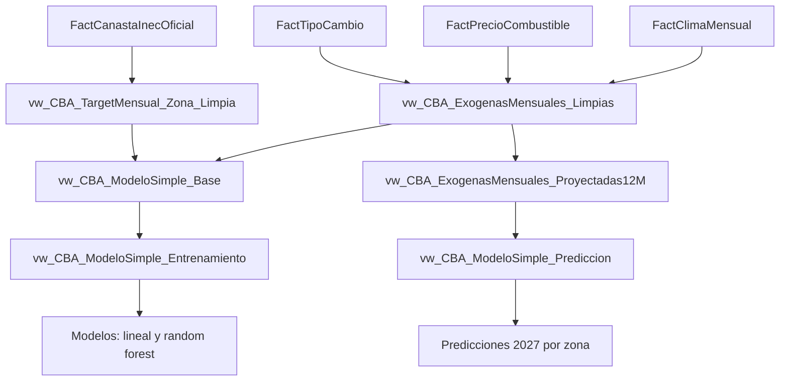

# Sistema Predictivo de la Canasta Basica Alimentaria de Costa Rica

Proyecto de analitica y prediccion orientado a estimar el valor mensual de la Canasta Basica Alimentaria (CBA) por zona a partir de un Data Warehouse en SQL Server.

El enfoque principal del repositorio es el modelo predictivo. Los ETLs existen para alimentar ese modelo con datos consistentes, limpios y comparables desde varias fuentes economicas y climaticas.

## Objetivo del proyecto

El sistema busca predecir el comportamiento mensual de la CBA para las zonas:

- `NACIONAL`
- `RURAL`
- `URBANO`

El modelo usa como variable objetivo el valor oficial de la CBA y combina:

- historial de la propia CBA
- tipo de cambio
- precio de combustibles
- clima mensual

La solucion compara dos algoritmos de regresion:

- regresion lineal
- random forest

Ambos se entrenan, se validan con datos historicos y luego generan pronosticos futuros sobre el mismo conjunto de entrada.

## Vision funcional


## Como funciona el sistema

El proyecto se divide en dos capas:

1. Capa de datos  
   Los ETLs extraen, transforman y cargan la informacion en el DW.

2. Capa predictiva  
   El modulo del modelo consume vistas limpias del DW, valida el comportamiento historico de los algoritmos y genera predicciones futuras.

## ETLs como base del modelo

Los ETLs no son un fin separado; son el proceso que prepara las variables que usa el modelo.

### Dominios ETL

- `etl_dolar`
  - obtiene el tipo de cambio
  - mantiene respaldo historico en CSV
  - carga `FactTipoCambio`

- `etl_combustible`
  - obtiene precios historicos de combustibles
  - clasifica productos
  - carga `FactPrecioCombustible`

- `etl_cba`
  - lee los archivos oficiales `.xlsx` del INEC
  - transforma el detalle por categoria y zona
  - contrasta el consolidado mensual oficial
  - carga `FactCanastaInecOficial`

- `etl_clima`
  - consulta NASA POWER
  - consolida temperatura, precipitacion, humedad y radiacion solar
  - carga `FactClimaMensual`

### Que aporta cada ETL al modelo

| ETL | Variable o uso en el modelo |
| --- | --- |
| Dolar | Tipo de cambio mensual |
| Combustible | Precio promedio mensual de combustibles |
| CBA oficial | Variable objetivo `CBA_TotalMensual` |
| Clima | Variables exogenas mensuales de clima |

## Data Warehouse del modelo

El modelo predictivo se apoya sobre un DW con tres capas:

- `staging`
- `dimensiones`
- `hechos`

### Tablas de staging

- `StagingFecha`
- `StagingTipoCambio`
- `StagingProducto`
- `StagingPrecioGasolina`
- `StagingInec`
- `StagingZonaClimatica`
- `StagingClimaMensual`

### Dimensiones

- `DimFecha`
- `DimFuenteDatos`
- `DimMoneda`
- `DimProducto`
- `DimZonaCBA`
- `DimCategoriaCBA`
- `DimZonaClimatica`

### Hechos

- `FactTipoCambio`
- `FactPrecioCombustible`
- `FactCanastaInecOficial`
- `FactClimaMensual`

## Vistas limpias para el modelo

El modelo no entrena directamente sobre las tablas base. Primero usa vistas limpias que organizan el flujo de prediccion.

### `dbo.vw_CBA_TargetMensual_Zona_Limpia`

Define la variable objetivo del modelo:

- una fila por `mes + zona`
- toma el total oficial `CBA`
- expone `CBA_TotalMensual`

### `dbo.vw_CBA_CoberturaFuentesMensual`

Muestra que meses tienen cobertura completa entre:

- CBA
- tipo de cambio
- combustibles
- clima

Sirve para auditar si el modelo esta entrenando sobre meses completos.

### `dbo.vw_CBA_ExogenasMensuales_Limpias`

Consolida las variables exogenas mensuales sin nulos:

- `TipoCambioPromedioMensual`
- `PrecioCombustiblePromedioMensual`
- `TempMaxProm`
- `TempMinProm`
- `PrecipitacionProm`
- `HumedadProm`
- `RadiacionSolarProm`

### `dbo.vw_CBA_ModeloSimple_Base`

Une:

- target mensual por zona
- variables exogenas limpias
- variable calendario `FlagFinAnio`

### `dbo.vw_CBA_ModeloSimple_Entrenamiento`

Expone el dataset final de entrenamiento:

- target `CBA_TotalMensual`
- zona
- `lag_1`
- `lag_3`
- exogenas mensuales
- variables de calendario

### `dbo.vw_CBA_ExogenasMensuales_Proyectadas12M`

Construye variables exogenas futuras para un horizonte de 12 meses a partir del mes actual dentro de un año.

### `dbo.vw_CBA_ModeloSimple_Prediccion`

Entrega las filas futuras por zona para el pronostico del modelo.

## Arquitectura del modelo predictivo



## Modulo del modelo

El modulo del modelo vive en:

- [MODELO_CBA.py](</C:/Users/d3smo/Desktop/CUC/Almacenes de datos/Nueva carpeta/Proyecto-AlmacenesDatos/MODELO_CBA.py>)
- [etl/src/modelo_predictivo_cba](</C:/Users/d3smo/Desktop/CUC/Almacenes de datos/Nueva carpeta/Proyecto-AlmacenesDatos/etl/src/modelo_predictivo_cba>)

### Componentes principales

- `models.py`
  - define configuracion, rutas y estructuras de resultados

- `repository.py`
  - lee las vistas del DW
  - valida que el esquema esperado exista

- `simple_model.py`
  - implementa los dos algoritmos de ML
  - serializa los artefactos entrenados

- `service.py`
  - coordina validacion, entrenamiento, comparacion contra `.xlsx` y prediccion

- `cli.py`
  - expone los comandos del modelo

## Estructura del repositorio

```text
Proyecto-AlmacenesDatos/
|-- ETL.py
|-- MODELO_CBA.py
|-- README.md
|-- dw_database/
|   |-- 01 - DW_Canasta.sql
|   |-- 02 - DW_Canasta_AzureSQL.sql
|   |-- vistas_modelo_predictivo_cba.sql
|   `-- vistas_metricas_modelo_cba_limpias.sql
|-- etl/
|   |-- data/
|   |   |-- raw/
|   |   `-- processed/
|   `-- src/
|       |-- admin_db_conn/
|       |-- etl_cba/
|       |-- etl_clima/
|       |-- etl_combustible/
|       |-- etl_dolar/
|       |-- modelo_predictivo_cba/
|       |-- app.py
|       |-- cli.py
|       |-- dw_manager.py
|       |-- runtime.py
|       `-- test_runner.py
`-- tests/
    |-- smoke/
    `-- unit/
```

## Preparacion del entorno

```powershell
python -m venv .venv
.\.venv\Scripts\activate
pip install -r requirements.txt
```

## Scripts SQL necesarios

### Crear el DW base

Para SQL Server local:

```text
dw_database/01 - DW_Canasta.sql
```

Para Azure SQL:

```text
dw_database/02 - DW_Canasta_AzureSQL.sql
```

### Crear las vistas del modelo

```text
dw_database/vistas_metricas_modelo_cba_limpias.sql
```

## CLI del ETL

El ETL se ejecuta desde:

```powershell
python ETL.py
```

### Funcion del CLI del ETL

El CLI de `ETL.py` permite:

- definir la conexion a SQL Server
- escoger el modo de carga
- regenerar historicos
- correr pruebas
- ampliar el rango del ETL de clima
- generar datos sinteticos de combustible

### Parametros principales del ETL

- `--server`
  - servidor o instancia SQL Server

- `--database`
  - base de datos destino

- `--username` y `--password`
  - autenticacion SQL

- `--trusted-connection`
  - autenticacion integrada de Windows

- `--modo-carga`
  - `direct-insert`
  - `historico`

- `--generar-historicos`
  - regenera CSV operativos antes de la carga

- `--clima-start-year`
  - anio inicial de consulta para clima

- `--clima-end-year`
  - anio final de consulta para clima

### Ejemplos de ejecucion del ETL

Conexion local:

```powershell
python ETL.py --server . --database DW_Dolar_Canasta --trusted-connection
```

Carga historica completa:

```powershell
python ETL.py --server . --database DW_Dolar_Canasta --modo-carga historico
```

Carga historica con clima ampliado:

```powershell
python ETL.py --server . --database DW_Dolar_Canasta --modo-carga historico --clima-start-year 2011 --clima-end-year 2026
```

Pruebas de ETL y conexion:

```powershell
python ETL.py --test-ETL
python ETL.py --test-DBconn --only-test
```

## CLI del modelo

El modelo se ejecuta desde:

```powershell
python MODELO_CBA.py <comando>
```

### Funcion del CLI del modelo

El CLI del modelo permite:

- validar que las vistas del DW esten listas
- contrastar el CBA cargado contra los `.xlsx` oficiales
- entrenar ambos modelos
- validar su comportamiento historico
- generar predicciones futuras por zona
- ejecutar todo el flujo en un solo comando

### Parametros principales del modelo

- `--server`
  - servidor o instancia SQL Server

- `--database`
  - base de datos del DW

- `--ruta-modelo`
  - prefijo base para guardar los modelos entrenados

- `--ruta-predicciones`
  - CSV de salida de predicciones

- `--ruta-validacion`
  - CSV de salida de validacion historica

- `--anio-validacion`
  - anio usado para el corte de validacion

- `--precision-minima`
  - umbral minimo de precision exigido al proceso

### Comandos del modelo

#### `validar-vistas`

Comprueba que:

- `dbo.vw_CBA_ModeloSimple_Entrenamiento`
- `dbo.vw_CBA_ModeloSimple_Prediccion`

tengan las columnas que el modulo necesita.

```powershell
python MODELO_CBA.py validar-vistas --server . --database DW_Dolar_Canasta
```

#### `comparar-fuente`

Contrasta el total oficial de la CBA del DW contra el consolidado mensual de los archivos `.xlsx` del INEC.

```powershell
python MODELO_CBA.py comparar-fuente --server . --database DW_Dolar_Canasta
```

Salida principal:

- `etl/data/processed/comparacion_cba_xlsx_vs_dw.csv`

#### `entrenar`

Entrena ambos modelos sobre la vista de entrenamiento y genera:

- validacion historica
- metricas por algoritmo
- archivos serializados de cada modelo

```powershell
python MODELO_CBA.py entrenar --server . --database DW_Dolar_Canasta
```

Salidas principales:

- `etl/data/processed/modelo_cba_simple_lineal.joblib`
- `etl/data/processed/modelo_cba_simple_random_forest.joblib`
- `etl/data/processed/validacion_cba_2025.csv`

#### `predecir`

Usa ambos modelos ya entrenados para generar predicciones futuras por zona.

```powershell
python MODELO_CBA.py predecir --server . --database DW_Dolar_Canasta
```

Salida principal:

- `etl/data/processed/predicciones_cba_2027.csv`

Ese CSV incluye:

- `FechaMes`
- `NombreZona`
- `PrediccionCBA_Lineal`
- `PrediccionCBA_RandomForest`

#### `pipeline`

Ejecuta el flujo completo del modelo:

1. validar vistas
2. contrastar DW vs `.xlsx`
3. entrenar y validar ambos modelos
4. generar predicciones futuras

```powershell
python MODELO_CBA.py pipeline --server . --database DW_Dolar_Canasta
```

## Logica de validacion del modelo

El modelo se valida con un corte temporal real. Por defecto usa:

- entrenamiento: anos anteriores a `2025`
- validacion: `2025`

Las metricas reportadas por algoritmo incluyen:

- precision porcentual
- rango de precision por zona
- MAE
- RMSE
- R2
- tiempo de validacion
- tiempo de entrenamiento

## Archivos de salida del modelo

Los resultados del modulo se escriben en `etl/data/processed/`.

Archivos principales:

- `comparacion_cba_xlsx_vs_dw.csv`
- `validacion_cba_2025.csv`
- `modelo_cba_simple_lineal.joblib`
- `modelo_cba_simple_random_forest.joblib`
- `predicciones_cba_2027.csv`

## Flujo recomendado de uso

### 1. Crear la base de datos y el DW

Ejecuta el script:

```text
dw_database/01 - DW_Canasta.sql
```

### 2. Cargar datos con los ETLs

```powershell
python ETL.py --server . --database DW_Dolar_Canasta --modo-carga historico
```

### 3. Crear las vistas del modelo

Ejecuta:

```text
dw_database/vistas_metricas_modelo_cba_limpias.sql
```

### 4. Validar y ejecutar el modelo

```powershell
python MODELO_CBA.py pipeline --server . --database DW_Dolar_Canasta
```

## Resumen del proyecto

Este repositorio implementa un sistema predictivo de la Canasta Basica Alimentaria apoyado en:

- ETLs especializados por dominio
- un Data Warehouse en SQL Server
- vistas limpias para entrenamiento y prediccion
- validacion contra la fuente oficial en `.xlsx`
- comparacion entre regresion lineal y random forest

El resultado es un flujo completo para preparar datos, validar consistencia y producir predicciones mensuales de la CBA por zona.
