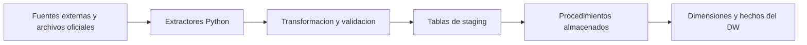
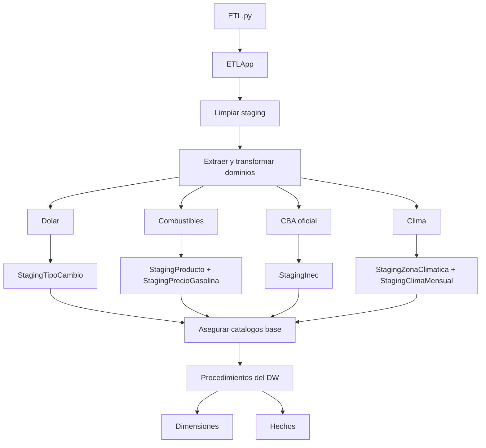
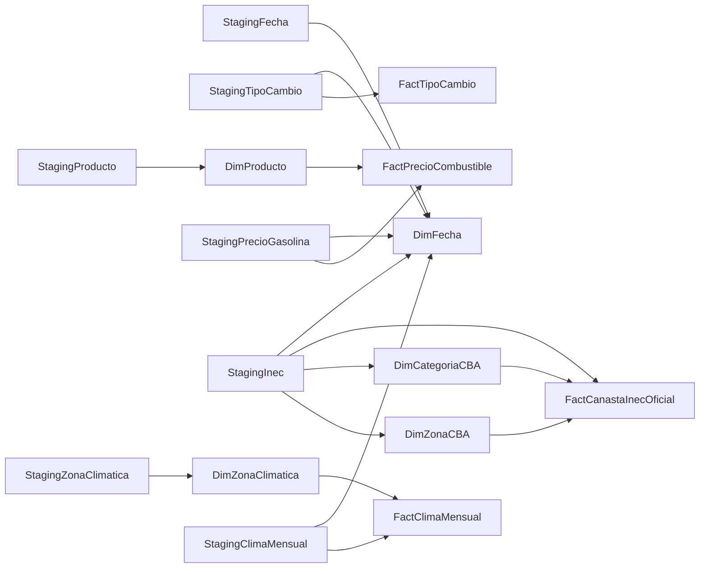

# ETL para Dolar, Combustibles, CBA Oficial y Clima

Pipeline ETL en Python + SQL Server orientado a consolidar datos de interes economico y operativo en un Data Warehouse unico. El flujo integra cuatro dominios desacoplados, aplica validaciones, carga tablas de staging y materializa dimensiones y hechos mediante procedimientos almacenados.

## Vision general

El proyecto procesa informacion de:

- tipo de cambio del dolar
- precios de combustibles
- canasta basica alimentaria oficial
- clima mensual para zonas bananeras de referencia

Cada dominio sigue la misma idea base:

1. extraer datos desde su fuente principal
2. usar respaldo local o simulacion si la fuente no responde
3. transformar y normalizar
4. cargar staging en SQL Server
5. poblar el DW final con procedimientos almacenados

## Que resuelve

- centraliza fuentes heterogeneas en un modelo analitico comun
- separa claramente extraccion, transformacion y carga
- conserva respaldos CSV para continuidad operativa
- valida consistencia antes de poblar el DW
- permite ejecutar pruebas tecnicas y de conexion antes del flujo real
- soporta una carga sintetica opcional para combustibles

## Arquitectura



### Componentes principales

- `ETL.py`: punto de entrada del proyecto.
- `etl/src/app.py`: orquesta el flujo completo.
- `etl/src/dw_manager.py`: limpia staging, asegura catalogos base y ejecuta las cargas finales del DW.
- `etl/src/etl_dolar`: integra API de Hacienda, respaldo CSV y simulacion.
- `etl/src/etl_combustible`: integra servicio de ARESEP, respaldo CSV y simulacion.
- `etl/src/etl_cba`: lee archivos oficiales del INEC y valida reconciliacion contra el consolidado.
- `etl/src/etl_clima`: extrae datos de NASA POWER y mantiene respaldo CSV.
- `dw_database/01 - DW_Canasta.sql`: script base para SQL Server.
- `dw_database/02 - DW_Canasta_AzureSQL.sql`: variante para Azure SQL Database.

## Flujo real del ETL

La aplicacion ejecuta los dominios en este orden:

1. dolar
2. combustibles
3. CBA oficial
4. clima

Antes de cargar el DW final, el flujo:

- limpia las tablas de staging
- registra y valida trazabilidad por dominio
- audita columnas obligatorias
- asegura catalogos compartidos como `DimFuenteDatos` y `DimMoneda`
- ejecuta procedimientos almacenados para transformar staging en tablas analiticas



## Fuentes de datos

| Dominio | Fuente principal | Respaldo |
| --- | --- | --- |
| Dolar | API del Ministerio de Hacienda de Costa Rica | `etl/data/raw/tipo_cambio_historico.csv` |
| Combustibles | Servicio historico de ARESEP | `etl/data/raw/combustible_historico.csv` |
| CBA oficial | Archivos XLSX del INEC | `etl/data/raw/cba/` |
| Clima | NASA POWER | `etl/data/raw/clima_historico.csv` |

### Detalle por dominio

- Dolar: carga tipo de cambio de compra y venta.
- Combustibles: clasifica productos y carga precios historicos.
- CBA oficial: transforma archivos por zona y categoria, y valida contra un consolidado mensual.
- Clima: consolida temperatura maxima, temperatura minima, precipitacion, humedad y radiacion solar por zona y mes.

## Modelo del Data Warehouse

El modelo se organiza en tres capas:

- `staging`: aterrizaje temporal de los datos procesados
- `dimensiones`: entidades descriptivas y catalogos compartidos
- `hechos`: tablas analiticas finales

### Dimensiones y catalogos

- `DimFecha`
- `DimFuenteDatos`
- `DimMoneda`
- `DimProducto`
- `DimZonaCBA`
- `DimCategoriaCBA`
- `DimZonaClimatica`

### Tablas de staging

- `StagingFecha`
- `StagingTipoCambio`
- `StagingProducto`
- `StagingPrecioGasolina`
- `StagingInec`
- `StagingZonaClimatica`
- `StagingClimaMensual`

### Tablas de hechos

- `FactTipoCambio`
- `FactPrecioCombustible`
- `FactCanastaInecOficial`
- `FactClimaMensual`

### Flujo de carga hacia el DW



## Estructura del repositorio

```text
Proyecto-AlmacenesDatos/
|-- ETL.py
|-- dw_database/
|   |-- 01 - DW_Canasta.sql
|   `-- 02 - DW_Canasta_AzureSQL.sql
|-- etl/
|   |-- data/raw/
|   `-- src/
|       |-- admin_db_conn/
|       |-- etl_cba/
|       |-- etl_clima/
|       |-- etl_combustible/
|       |-- etl_dolar/
|       |-- app.py
|       |-- cli.py
|       |-- dw_manager.py
|       |-- runtime.py
|       |-- test_runner.py
|       `-- trazabilidad.py
`-- tests/
    |-- smoke/
    `-- unit/
```

## Ejecucion

### Preparacion

```powershell
python -m venv .venv
.\.venv\Scripts\activate
pip install -r requirements.txt
```

### Conexion a SQL Server local

```powershell
python ETL.py --server .\SQLEXPRESS --trusted-connection
```

### Conexion con usuario y password

```powershell
python ETL.py --server localhost --database DW_Dolar_Canasta --username sa --password secreto --no-trusted-connection
```

### Ejecucion historica

```powershell
python ETL.py --modo-carga historico
```

### Ejecucion con combustible sintetico

```powershell
python ETL.py --sinteticos
```

## Pruebas

### Suite general

```powershell
.\.venv\Scripts\python.exe -m pytest -q
```

### Validacion de conexion y base de datos

```powershell
python ETL.py --test-DBconn --only-test
```

### Validacion por ETL

```powershell
python ETL.py --test-ETL
python ETL.py --test-ETL dolar combustible clima --only-test
```

## Notas de despliegue

- Para SQL Server local o de instancia completa, usa `01 - DW_Canasta.sql`.
- Para Azure SQL Database, usa `02 - DW_Canasta_AzureSQL.sql`.
- En Azure SQL, el endpoint debe indicarse con el servidor completo, por ejemplo `nombre-servidor.database.windows.net`.

## Resumen

Este repositorio implementa un ETL modular con trazabilidad, validaciones y carga analitica sobre SQL Server. El resultado es un Data Warehouse listo para consultas sobre tipo de cambio, combustibles, CBA oficial y clima, con una estructura clara de staging, dimensiones y hechos.
