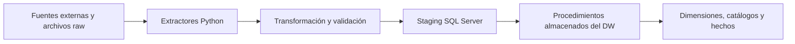
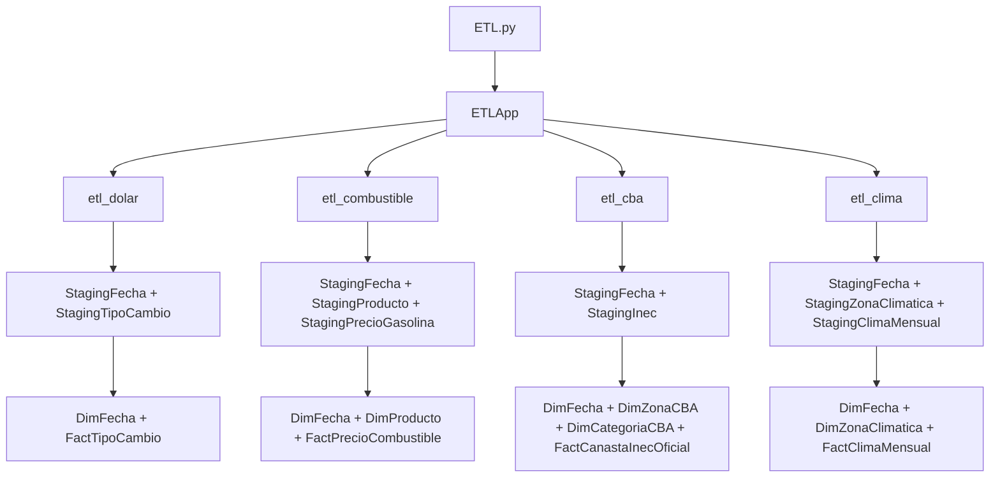
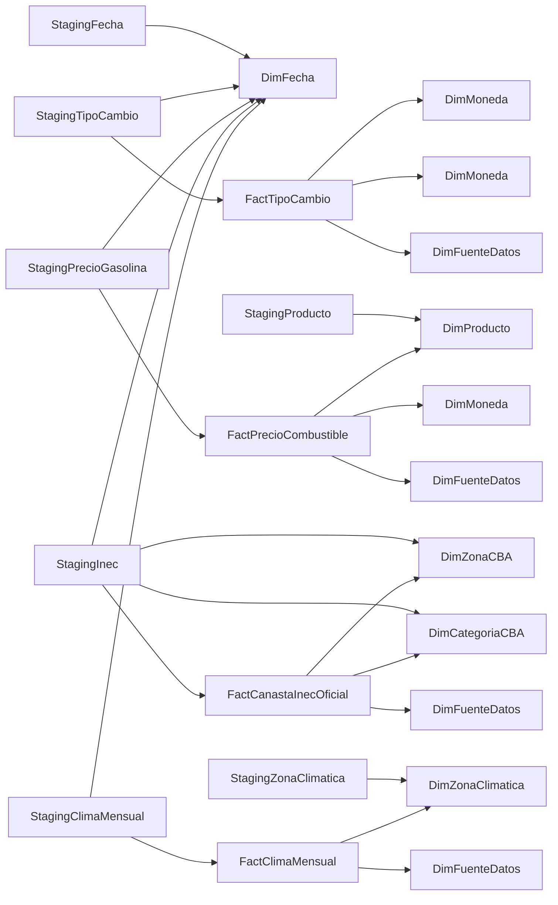
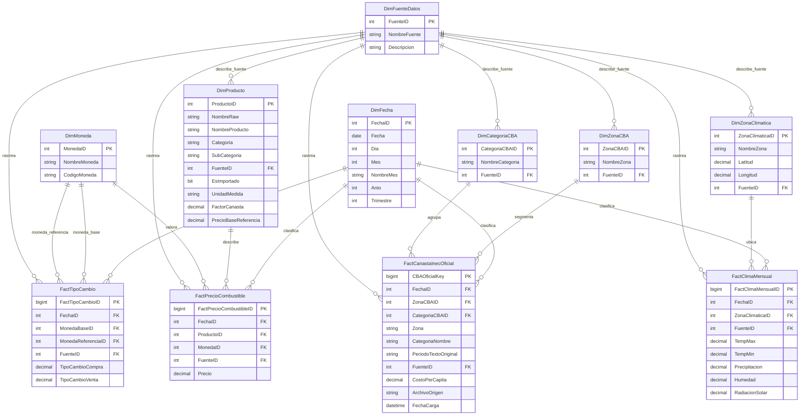
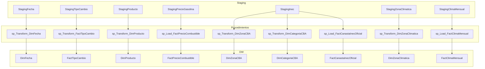

# ETL de Dolar, Combustibles, CBA Oficial y Clima

Este proyecto implementa un flujo ETL en Python + SQL Server para poblar un Data Warehouse desde cuatro dominios desacoplados:

- `etl_dolar`
- `etl_combustible`
- `etl_cba`
- `etl_clima`

## Introduccion

- la aplicación principal ejecuta `dolar -> combustible -> cba -> clima`
- cada dominio carga primero a `staging` y después al DW mediante procedimientos almacenados
- la CBA oficial usa `etl/data/raw/cba` como fuente operativa real
- los catálogos base del DW se aseguran desde [etl/src/dw_manager.py](C:/Users/d3smo/Desktop/CUC/Almacenes%20de%20datos/Nueva%20carpeta/Proyecto-AlmacenesDatos/etl/src/dw_manager.py)
- el smoke test SQL crea una base temporal aislada y limpia bases `DW_Dolar_Canasta_Smoke_*` huérfanas antes de correr

## Flujo general



## Flujo por ETL



## Fuentes por dominio

### Dólar

- fuente principal: API del Ministerio de Hacienda de Costa Rica
- respaldo operativo: `etl/data/raw/tipo_cambio_historico.csv`
- fallback final: simulación controlada

### Combustibles

- fuente principal: servicio histórico de ARESEP
- respaldo operativo: `etl/data/raw/combustible_historico.csv`
- fallback final: simulación controlada

### CBA oficial

- fuente principal: archivos oficiales del INEC en `etl/data/raw/cba`
- archivos detallados esperados:
  - `CBANacional_*XMESyProducto.xlsx`
  - `CBAUrbano_*XMESyProducto.xlsx`
  - `CBARural_*XMESyProducto.xlsx`
- archivo de control para reconciliación:
  - `CBA_2011-2026XMES.xlsx`

La carga principal de CBA sale de los archivos detallados por zona y categoría. El consolidado mensual se usa para validar que los totales `CBA` coincidan antes de cargar el DW.

### Clima

- fuente principal: NASA POWER
- respaldo operativo: `etl/data/raw/clima_historico.csv`

## Estructura del proyecto

```text
Proyecto-AlmacenesDatos/
|-- ETL.py
|-- README.md
|-- requirements.txt
|-- requirements-dev.txt
|-- dw_database/
|   `-- 01 - DW_Canasta.sql
|-- etl/
|   |-- data/
|   |   `-- raw/
|   |       |-- cba/
|   |       |-- clima_historico.csv
|   |       |-- combustible_historico.csv
|   |       `-- tipo_cambio_historico.csv
|   `-- src/
|       |-- admin_db_conn/
|       |-- etl_cba/
|       |-- etl_clima/
|       |-- etl_combustible/
|       |-- etl_dolar/
|       |-- app.py
|       |-- cli.py
|       |-- dw_manager.py
|       |-- runtime.py
|       |-- test_runner.py
|       `-- trazabilidad.py
`-- tests/
    |-- smoke/
    `-- unit/
        |-- core/
        |-- etl_cba/
        |-- etl_clima/
        |-- etl_combustible/
        `-- etl_dolar/
```

## Responsabilidades principales

### Punto de entrada

- [ETL.py](C:/Users/d3smo/Desktop/CUC/Almacenes%20de%20datos/Nueva%20carpeta/Proyecto-AlmacenesDatos/ETL.py)
  - arranca el proyecto
  - ejecuta pruebas si se solicitan
  - transfiere el control al flujo real

### Orquestación

- [etl/src/app.py](C:/Users/d3smo/Desktop/CUC/Almacenes%20de%20datos/Nueva%20carpeta/Proyecto-AlmacenesDatos/etl/src/app.py)
  - coordina los cuatro ETLs
  - valida trazabilidad
  - dispara carga a staging y DW

- [etl/src/dw_manager.py](C:/Users/d3smo/Desktop/CUC/Almacenes%20de%20datos/Nueva%20carpeta/Proyecto-AlmacenesDatos/etl/src/dw_manager.py)
  - limpia staging
  - asegura catálogos base
  - ejecuta los procedimientos almacenados finales del DW

### ETLs por dominio

- `etl/src/etl_dolar`
  - extracción de tipo de cambio
  - fallback a CSV y simulación
  - carga a `StagingTipoCambio`

- `etl/src/etl_combustible`
  - extracción ARESEP
  - clasificación de combustibles
  - carga a `StagingProducto` y `StagingPrecioGasolina`

- `etl/src/etl_cba`
  - lectura de archivos oficiales INEC
  - normalización de periodos, zonas y categorías
  - validación contra el consolidado oficial
  - carga a `StagingInec`

- `etl/src/etl_clima`
  - extracción desde NASA POWER
  - normalización mensual
  - carga a `StagingZonaClimatica` y `StagingClimaMensual`

## Modelo actual del DW

El archivo [dw_database/01 - DW_Canasta.sql](C:/Users/d3smo/Desktop/CUC/Almacenes%20de%20datos/Nueva%20carpeta/Proyecto-AlmacenesDatos/dw_database/01%20-%20DW_Canasta.sql) define tres capas explícitas:

1. `staging`: tablas de aterrizaje por ETL
2. `catálogos y dimensiones`: entidades compartidas y descriptivas
3. `hechos`: tablas analíticas finales

### Catálogos base y dimensiones

Catálogos compartidos:

- `DimFuenteDatos`
  - catálogo de procedencia lógica de los datos
  - valores base asegurados por `dw_manager.py`:
    - `1`: Ministerio de Hacienda CR
    - `2`: ARESEP
    - `3`: Respaldo local o simulado
    - `4`: NASA POWER
    - `5`: INEC

- `DimMoneda`
  - catálogo monetario base
  - valores base asegurados por `dw_manager.py`:
    - `1`: USD
    - `2`: CRC

Dimensiones analíticas:

- `DimFecha`
- `DimProducto`
- `DimZonaCBA`
- `DimCategoriaCBA`
- `DimZonaClimatica`

### Tablas de staging

- `StagingFecha`
  - calendario operativo compartido por todos los dominios

- `StagingTipoCambio`
  - staging del ETL dólar
  - contiene `FechaID`, monedas y valores de compra/venta

- `StagingProducto`
  - staging descriptivo del ETL combustible
  - alimenta `DimProducto`

- `StagingPrecioGasolina`
  - staging transaccional del ETL combustible
  - alimenta `FactPrecioCombustible`

- `StagingInec`
  - staging oficial del ETL CBA
  - contiene `Fecha`, `FechaID`, `Zona`, `CategoriaNombre`, `PeriodoTextoOriginal`, `CostoPerCapita`, `ArchivoOrigen`, `FuenteID`

- `StagingZonaClimatica`
  - staging descriptivo del ETL clima
  - alimenta `DimZonaClimatica`

- `StagingClimaMensual`
  - staging transaccional del ETL clima
  - alimenta `FactClimaMensual`

### Hechos finales

- `FactTipoCambio`
- `FactPrecioCombustible`
- `FactCanastaInecOficial`
- `FactClimaMensual`

### Procedimientos almacenados

- `sp_InsertarTipoCambioStaging`
- `sp_Transform_DimFecha`
- `sp_Transform_DimProducto`
- `sp_Transform_DimZonaCBA`
- `sp_Transform_DimCategoriaCBA`
- `sp_Transform_DimZonaClimatica`
- `sp_Transform_FactTipoCambio`
- `sp_Load_FactPrecioCombustible`
- `sp_Load_FactCanastaInecOficial`
- `sp_Load_FactClimaMensual`

## Relaciones actuales del modelo

### Relación staging -> catálogos/dimensiones -> hechos



### Diagrama dimensional del DW



### Diagrama de staging y carga final



## Cadenas de carga por dominio

### Dólar

```text
API / CSV / simulación -> StagingFecha + StagingTipoCambio -> sp_Transform_DimFecha + sp_Transform_FactTipoCambio -> FactTipoCambio
```

### Combustibles

```text
ARESEP / CSV / simulación -> StagingFecha + StagingProducto + StagingPrecioGasolina -> sp_Transform_DimFecha + sp_Transform_DimProducto + sp_Load_FactPrecioCombustible -> FactPrecioCombustible
```

### CBA oficial

```text
Archivos XLSX INEC -> StagingFecha + StagingInec -> sp_Transform_DimFecha + sp_Transform_DimZonaCBA + sp_Transform_DimCategoriaCBA + sp_Load_FactCanastaInecOficial -> FactCanastaInecOficial
```

### Clima

```text
NASA POWER / CSV -> StagingFecha + StagingZonaClimatica + StagingClimaMensual -> sp_Transform_DimFecha + sp_Transform_DimZonaClimatica + sp_Load_FactClimaMensual -> FactClimaMensual
```

## Preparación del entorno

### 1. Crear y activar entorno virtual

```powershell
python -m venv .venv
.\.venv\Scripts\Activate.ps1
```

### 2. Instalar dependencias

```powershell
pip install -r requirements.txt
pip install -r requirements-dev.txt
```

Dependencias principales:

- `pandas`
- `pyodbc`
- `requests`
- `pytest`

### 3. Preparar la base de datos

Ejecuta el script:

- [dw_database/01 - DW_Canasta.sql](C:/Users/d3smo/Desktop/CUC/Almacenes%20de%20datos/Nueva%20carpeta/Proyecto-AlmacenesDatos/dw_database/01%20-%20DW_Canasta.sql)

El script está pensado para una base limpia y crea directamente la estructura actual del DW.

### 4. Verificar archivos raw de CBA

La carpeta `etl/data/raw/cba` debe contener los cuatro archivos oficiales del INEC. Sin ellos, el ETL de CBA no puede ejecutarse correctamente.

## Ejecución del ETL

### Ejecución normal

```powershell
python ETL.py
```

### Modo directo

```powershell
python ETL.py --modo-carga direct-insert
```

### Modo histórico

```powershell
python ETL.py --modo-carga historico
```

### Modo histórico sin regenerar respaldos CSV

```powershell
python ETL.py --modo-carga historico --no-generar-historicos
```

### Conexión a SQL Server con autenticación integrada

```powershell
python ETL.py --server .\SQLEXPRESS --trusted-connection
```

### Conexión a SQL Server con usuario y password

```powershell
python ETL.py --server localhost --database DW_Dolar_Canasta --username sa --password secreto --no-trusted-connection
```

## Pruebas

### Ejecutar toda la suite con pytest

```powershell
.\.venv\Scripts\python.exe -m pytest -q
```

### Ejecutar validación integral desde el CLI

```powershell
python ETL.py --test
```

Esto corre:

1. pruebas `core`
2. pruebas por ETL
3. smoke SQL
4. flujo real, salvo que se combine con `--only-test`

### Ejecutar pruebas por ETL

```powershell
python ETL.py --test-ETL
python ETL.py --test-ETL dolar combustible
python ETL.py --test-ETL cba
python ETL.py --test-ETL clima --only-test
```

Objetivos válidos:

- `dolar`
- `combustible`
- `cba`
- `clima`
- `all`

### Ejecutar smoke SQL

```powershell
python ETL.py --test-DBconn --only-test
```

También se puede correr manualmente con variables de entorno:

```powershell
$env:ETL_SMOKE_SQL = "1"
$env:ETL_SQL_SERVER = "localhost"
$env:ETL_SQL_DRIVER = "ODBC Driver 17 for SQL Server"
$env:ETL_SQL_TRUSTED_CONNECTION = "1"
.\.venv\Scripts\python.exe -m pytest -q tests\smoke
```

El smoke test:

- crea una base temporal `DW_Dolar_Canasta_Smoke_*`
- carga datos mínimos por dominio
- ejecuta los procedimientos del DW
- valida que staging, dimensiones y hechos finales reciban registros
- limpia bases temporales huérfanas de ejecuciones anteriores

## Validaciones de calidad

El proyecto aplica validaciones para evitar cargas inconsistentes:

- descarte de filas no utilizables antes de staging
- validación de columnas obligatorias
- trazabilidad entre origen, CSV, staging y DW
- reconciliación de CBA oficial contra el consolidado mensual del INEC
- auditoría de no nulos en tablas clave del staging, catálogos y hechos
