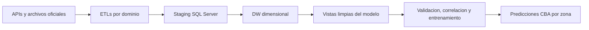
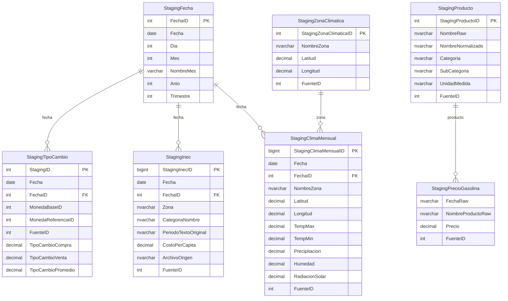
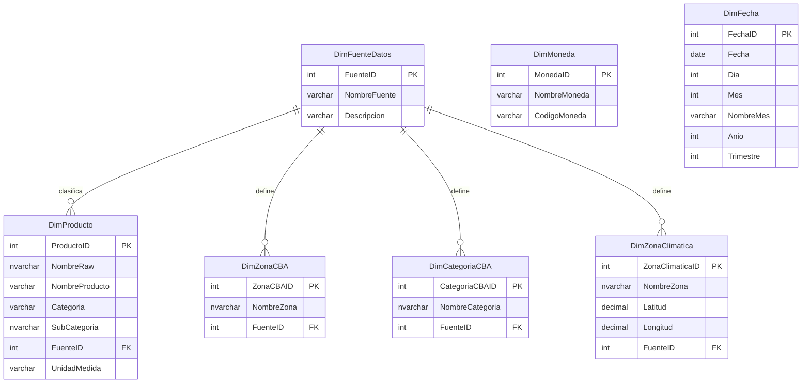
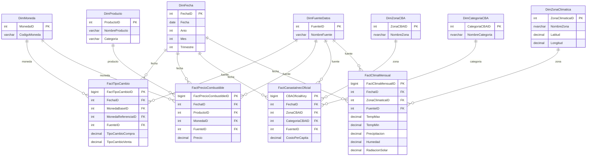

# Sistema Predictivo de la Canasta Basica Alimentaria de Costa Rica

Proyecto de analitica, integracion de datos y modelado predictivo orientado a estimar el comportamiento mensual de la Canasta Basica Alimentaria (CBA) en Costa Rica a partir de un Data Warehouse en SQL Server.

El repositorio integra un flujo completo que:

- extrae datos desde APIs, archivos oficiales y respaldos CSV
- consolida los datos en staging y en un DW dimensional
- construye vistas limpias para analisis y modelado
- entrena y compara algoritmos de prediccion
- genera salidas CSV para validacion, correlacion y pronostico

## Vision general



## Que integra el proyecto

### ETLs por dominio

- `etl_dolar`
  obtiene tipo de cambio diario e historico

- `etl_combustible`
  obtiene precios historicos de combustibles y clasifica productos

- `etl_cba`
  lee los archivos oficiales `.xlsx` del INEC y reconcilia el consolidado mensual

- `etl_clima`
  consulta NASA POWER y consolida variables climaticas mensuales

### Capa de persistencia

- staging para cargas transitorias y validacion operacional
- dimensiones y hechos en SQL Server
- procedimientos almacenados para poblar el DW
- vistas limpias para entrenamiento y pronostico

### Capa de modelo

- regresion lineal
- random forest como algoritmo principal de presentacion
- validacion temporal historica
- comparacion entre algoritmos
- matriz de correlacion entre CBA y variables exogenas

## Variables que alimentan el modelo

La variable objetivo del modelo es `CBA_TotalMensual`.

Las variables exogenas principales son:

- `TipoCambioPromedioMensual`
- `PrecioCombustiblePromedioMensual`
- `TempMaxProm`
- `TempMinProm`
- `PrecipitacionProm`
- `HumedadProm`
- `RadiacionSolarProm`

El flujo de entrenamiento tambien incorpora:

- `lag_1`
- `lag_3`
- `CantidadCategorias`
- `FlagFinAnio`
- `NombreZona`

## Arquitectura de datos

### Staging



### Catalogos y dimensiones



### DW dimensional



## Vistas del modelo

Las vistas principales que sirven al modulo predictivo son:

- `dbo.vw_CBA_TargetMensual_Zona_Limpia`
- `dbo.vw_CBA_CoberturaFuentesMensual`
- `dbo.vw_CBA_ExogenasMensuales_Limpias`
- `dbo.vw_CBA_ModeloSimple_Base`
- `dbo.vw_CBA_ModeloSimple_Entrenamiento`
- `dbo.vw_CBA_ExogenasMensuales_Proyectadas12M`
- `dbo.vw_CBA_ModeloSimple_Prediccion`

## Estructura del repositorio

```text
Proyecto-AlmacenesDatos/
|-- ETL.py
|-- MODELO_CBA.py
|-- README.md
|-- dw_database/
|   |-- 01 - DW_Canasta.sql
|   |-- 02 - DW_Canasta_AzureSQL.sql
|   `-- vistas_metricas_modelo_cba_limpias.sql
|-- etl/
|   |-- data/
|   |   |-- raw/
|   |   `-- processed/
|   `-- src/
|       |-- admin_db_conn/
|       |-- etl_cba/
|       |-- etl_clima/
|       |-- etl_combustible/
|       |-- etl_dolar/
|       |-- modelo_predictivo_cba/
|       `-- ...
`-- tests/
```

## Preparacion del entorno

```powershell
python -m venv .venv
.\.venv\Scripts\activate
pip install -r requirements.txt
pip install -r requirements-dev.txt
```

## Scripts SQL

### Crear el DW

SQL Server local:

```text
dw_database/01 - DW_Canasta.sql
```

Azure SQL:

```text
dw_database/02 - DW_Canasta_AzureSQL.sql
```

### Crear las vistas del modelo

```text
dw_database/vistas_metricas_modelo_cba_limpias.sql
```

## CLI del ETL

Entrada principal:

```powershell
python ETL.py
```

### Parametros de conexion

- `--server`
  servidor o instancia de SQL Server

- `--database`
  base de datos destino del DW

- `--driver`
  driver ODBC de conexion

- `--username`
  usuario SQL Server

- `--password`
  contrasena SQL Server

- `--trusted-connection`
  usa autenticacion integrada de Windows

- `--no-trusted-connection`
  desactiva autenticacion integrada

### Parametros operativos

- `--modo-carga`
  `direct-insert` o `historico`

- `--generar-historicos`
  actualiza CSV operativos antes de poblar staging

- `--no-generar-historicos`
  reutiliza respaldos existentes

- `--sinteticos`
  genera e inserta datos sinteticos de combustible

- `--clima-start-year`
  anio inicial de consulta a NASA POWER

- `--clima-end-year`
  anio final de consulta a NASA POWER

### Parametros de prueba

- `--test`
  ejecuta la prueba integral de la solucion

- `--test-ETL`
  ejecuta pruebas de ETL por dominio

- `--test-DBconn`
  ejecuta pruebas de conexion y BD dummy

- `--only-test`
  ejecuta solo pruebas y no continua el flujo real

### Ejemplos ETL

```powershell
python ETL.py --server . --database DW_Dolar_Canasta --trusted-connection
python ETL.py --modo-carga historico
python ETL.py --modo-carga historico --clima-start-year 2011 --clima-end-year 2026
python ETL.py --test
python ETL.py --test-ETL cba
python ETL.py --test-DBconn --only-test
python ETL.py --sinteticos
```

## CLI del modelo

Entrada principal:

```powershell
python MODELO_CBA.py <comando>
```

### Comandos disponibles

- `validar-vistas`
  verifica que las vistas del DW tengan las columnas esperadas

- `comparar-fuente`
  compara el total oficial del DW contra los archivos `.xlsx` del INEC

- `correlacion-exogenas`
  genera la matriz de correlacion entre `CBA_TotalMensual` y las variables exogenas

- `entrenar`
  entrena Random Forest y regresion lineal y genera validacion historica

- `predecir`
  carga modelos entrenados y genera el CSV de prediccion a 12 meses

- `pipeline`
  ejecuta validacion de vistas, comparacion de fuente, entrenamiento y prediccion

### Parametros de conexion

- `--server`
- `--database`
- `--driver`
- `--username`
- `--password`
- `--trusted-connection`
- `--no-trusted-connection`

### Parametros funcionales del modelo

- `--vista-entrenamiento`
  vista con target, lags y variables exogenas

- `--vista-prediccion`
  vista con variables futuras para el horizonte de pronostico

- `--ruta-modelo`
  ruta base para guardar artefactos de cada algoritmo

- `--ruta-predicciones`
  CSV de salida de predicciones

- `--ruta-validacion`
  CSV de validacion historica

- `--ruta-correlacion`
  CSV de correlacion entre CBA y exogenas

- `--anio-validacion`
  corte temporal usado como conjunto de prueba historico

- `--precision-minima`
  precision minima exigida al mejor algoritmo validado

### Ejemplos del modelo

```powershell
python MODELO_CBA.py validar-vistas --server . --database DW_Dolar_Canasta
python MODELO_CBA.py comparar-fuente --server . --database DW_Dolar_Canasta
python MODELO_CBA.py correlacion-exogenas --server . --database DW_Dolar_Canasta
python MODELO_CBA.py entrenar --server . --database DW_Dolar_Canasta
python MODELO_CBA.py predecir --server . --database DW_Dolar_Canasta
python MODELO_CBA.py pipeline --server . --database DW_Dolar_Canasta
```

## Archivos de salida

Los principales artefactos del proyecto se escriben en `etl/data/processed/`.

- `comparacion_cba_xlsx_vs_dw.csv`
- `validacion_cba_2025.csv`
- `correlacion_cba_vs_exogenas.csv`
- `modelo_cba_simple_random_forest.joblib`
- `modelo_cba_simple_lineal.joblib`
- `predicciones_cba_2027.csv`

## Flujo recomendado

### 1. Crear la base de datos

```text
dw_database/01 - DW_Canasta.sql
```

### 2. Ejecutar ETLs

```powershell
python ETL.py --server . --database DW_Dolar_Canasta --modo-carga historico
```

### 3. Crear las vistas del modelo

```text
dw_database/vistas_metricas_modelo_cba_limpias.sql
```

### 4. Validar y operar el modelo

```powershell
python MODELO_CBA.py pipeline --server . --database DW_Dolar_Canasta
```

### 5. Generar matriz de correlacion

```powershell
python MODELO_CBA.py correlacion-exogenas --server . --database DW_Dolar_Canasta
```

## Resumen

Este proyecto integra ETLs especializados, un DW dimensional en SQL Server y un modulo predictivo para analizar y pronosticar la CBA mensual por zona. El flujo permite cargar fuentes heterogeneas, validar consistencia con la fuente oficial, correlacionar el CBA con variables exogenas y producir predicciones comparadas entre Random Forest y regresion lineal.
